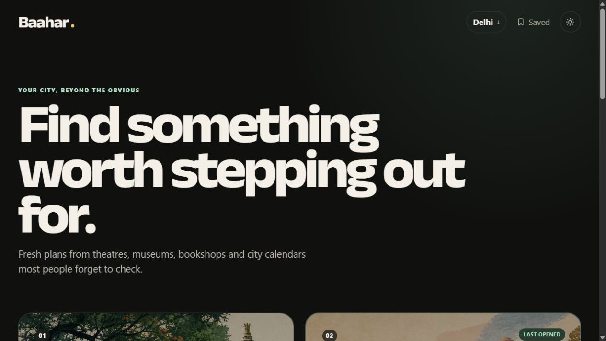
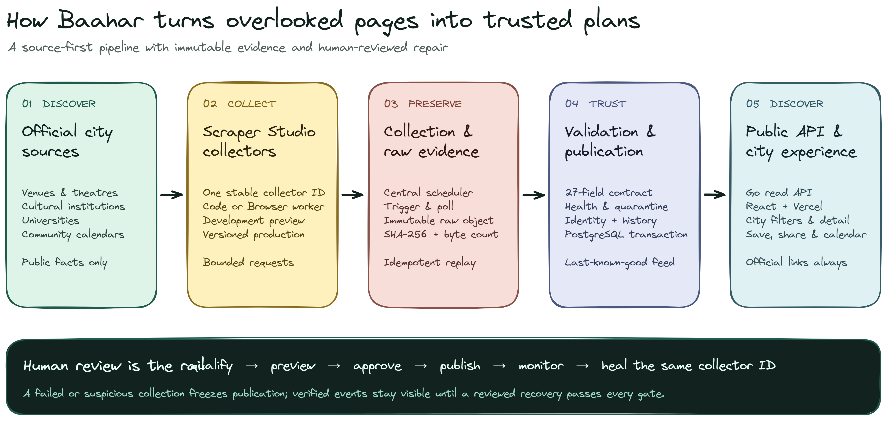

<div align="center">

# Baahar

**Find something worth stepping out for.**

Source-first event discovery for the city beyond the obvious.

[**Explore Baahar ↗**](https://baahar.vercel.app) ·
[Browse the source registry](sources/README.md) ·
[Suggest a source](https://github.com/siiddhantt/baahar/issues/new?template=source-suggestion.yml)

[](https://baahar.vercel.app)
[](https://github.com/siiddhantt/baahar/actions/workflows/ci.yml)
[](LICENSE)

</div>

[](https://baahar.vercel.app)

Baahar looks for public plans where large event platforms often do not: theatre
programmes, venue calendars, bookshops, cultural institutions, universities,
and community event boards. It turns those scattered pages into one calm,
filterable city feed while keeping every event linked to its official source.

## Why Baahar

| Find the overlooked                                                              | Publish facts, not guesses                                                                            | Stay useful when pages change                                                                               |
| -------------------------------------------------------------------------------- | ----------------------------------------------------------------------------------------------------- | ----------------------------------------------------------------------------------------------------------- |
| Official long-tail sources add events that never reach the largest marketplaces. | Unknown prices, eligibility, and registration details remain unknown until the source says otherwise. | Suspicious collections freeze publication; the last verified plans remain visible during a reviewed repair. |

The public experience supports city, date, category, and free filters; event
details; official links; local saves; native sharing; and calendar files. Public
visitors never trigger a scrape.

## Verified coverage

| City          | Official sources                                                                                                                                                                          | What they add                                                                            |
| ------------- | ----------------------------------------------------------------------------------------------------------------------------------------------------------------------------------------- | ---------------------------------------------------------------------------------------- |
| **Bengaluru** | [Bangalore International Centre](sources/bengaluru/bic/), [Jagriti Theatre](sources/bengaluru/jagriti/), [Atta Galatta](sources/bengaluru/atta-galatta/), [BIEC](sources/bengaluru/biec/) | Talks, theatre, books, workshops, culture, community programmes, and professional expos. |
| **Delhi**     | [The Piano Man](sources/delhi/the-piano-man/)                                                                                                                                             | Public music sessions across the organiser's Delhi venues.                               |
| **Mumbai**    | [Prithvi Theatre](sources/mumbai/prithvi-theatre/)                                                                                                                                        | Theatre, music, arts, and talk performances from the official booking system.            |
| **Varanasi**  | [BHU Academic Events](sources/varanasi/bhu-academic-events/)                                                                                                                              | Public workshops, seminars, conferences, and academic programmes.                        |

Coverage is intentionally source-counted rather than described as complete.
The [source registry](sources/README.md) also lists Development, research-only,
and access-limited collectors without mixing them into the public feed.

## How it works

[](docs/assets/architecture/baahar-system.excalidraw)

The diagram is editable in
[Excalidraw](docs/assets/architecture/baahar-system.excalidraw). Bright Data
Scraper Studio owns collection, versioned workers, previews, and repair.
Baahar owns scheduling, immutable raw artifacts, the 27-field contract, health
and quarantine, identity and history, publication, the Go API, and the web app.

There are no product-runtime LLM calls and no automatic repair approvals.

<details>
<summary><strong>What the same-collector self-heal demonstration proved</strong></summary>

A controlled BIEC Development selector change produced zero rows while the
reviewed Production version and last-known-good Baahar feed stayed live. Bright
Data proposed a repair on the same collector ID; the diff and preview were
reviewed before approval, the exact worker was synchronized back to Git, and a
new Production version published 9/9 valid rows. An immutable replay reproduced
the publication without making a second collection call.

[Read the evidence ledger](sources/bengaluru/biec/evidence/README.md).

</details>

## Why collector code lives here

Scraper Studio is the deployed runtime. The `sources/` directory is the durable,
reviewable source of truth for each collector's worker, mapping, request limits,
identity rules, access research, and external evidence. When a page drifts or a
repair is approved, the exact Studio revision is copied back here and its focused
tests and evidence ledger are updated.

Private raw datasets, credentials, and dashboard exports are deliberately not
committed. The [source registry](sources/README.md) explains the directory
contract and the [source template](sources/SOURCE_TEMPLATE.md) keeps new
collectors consistent.

## Run it locally

Requirements: Go 1.26, Node.js 24, Docker with Compose, and a Bright Data token
for collection work.

```powershell
Copy-Item .env.example .env
docker compose up -d postgres minio create-bucket
go run ./cmd/migrate up
npm ci --prefix apps/web
```

Then run the API, worker, and web app in separate shells:

```powershell
go run ./cmd/api
go run ./cmd/worker
npm --prefix apps/web run dev
```

Environment setup, safe UI-only development, and quality commands are in the
[local development guide](docs/DEVELOPMENT.md).

## Deploy

Baahar has three deployable processes: a static Vite web app, a stateless Go
API, and an independent Go scheduler/worker. Production also needs PostgreSQL
and private S3-compatible object storage. This keeps collection work outside the
visitor request path and lets the API continue serving verified data during a
source outage.

See the [deployment contract](docs/DEPLOYMENT.md) for the smallest supported
topology, secrets, release order, and operational checks.

## Project guide

- [Architecture](docs/ARCHITECTURE.md) — domain boundaries, storage, collection,
  health, API, and failure handling.
- [Product requirements](docs/PRD.md) — the problem, audience, release scope, and
  product invariants.
- [Experience](docs/EXPERIENCE.md) — interaction, accessibility, and visual
  direction.
- [Source catalog](docs/SOURCES.md) — qualification research and source
  precedence.
- [Quality evidence](docs/QUALITY.md) — executable proof across collectors,
  PostgreSQL, object storage, API, and frontend.

## Contributing

Suggestions are welcome—especially official event pages Baahar should cover.
[Suggest a source](https://github.com/siiddhantt/baahar/issues/new?template=source-suggestion.yml),
[propose a feature](https://github.com/siiddhantt/baahar/issues/new?template=feature-request.yml),
or read [the contribution guide](CONTRIBUTING.md) before opening a code change.

## License

Baahar is available under the [MIT License](LICENSE).
