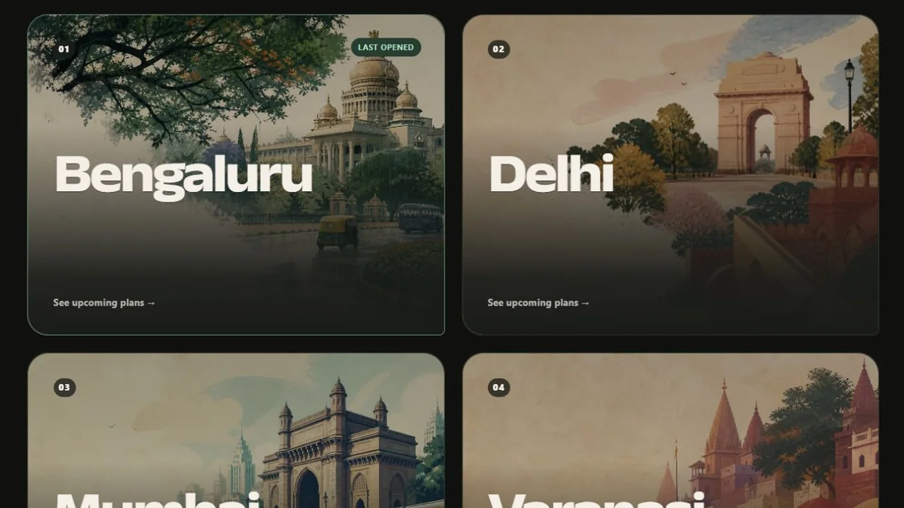
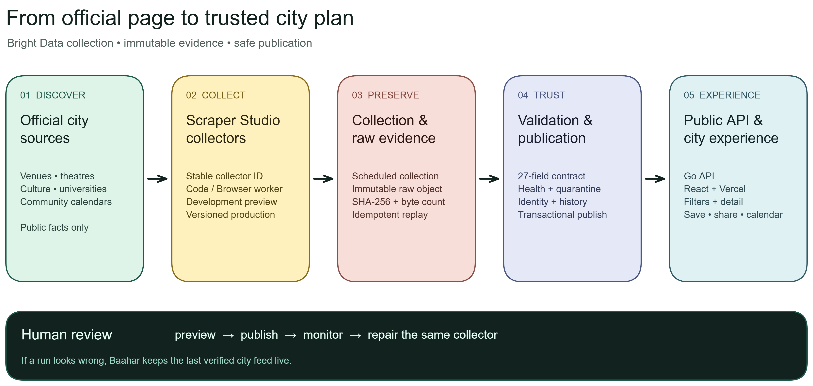

<div align="center">


# Baahar

**One place for the city plans hiding across official calendars.**

[**Explore Baahar ↗**](https://baahar.vercel.app) ·
[See the sources](sources/README.md) ·
[Suggest a source](https://github.com/siiddhantt/baahar/issues/new?template=source-suggestion.yml)

[](https://baahar.vercel.app)
[](https://github.com/siiddhantt/baahar/actions/workflows/ci.yml)
[](LICENSE)

</div>

<a href="https://baahar.vercel.app">
  
</a>

## What Baahar is

Event information is already online, but it is scattered across venue pages,
theatre schedules, cultural calendars, universities, and organisers' booking
systems. Baahar brings those public facts into one calm city guide and always
links each plan back to its official page.

In this project, **scraping simply means software reading a public page and
copying the useful facts a person could see there**—the title, date, time,
venue, price, and official link. It does not mean guessing missing details or
collecting private information.

Baahar performs that work on a shared schedule, not when somebody opens the
website. One collection can therefore update the feed for every visitor. Today,
seven reviewed collectors support Bengaluru, Delhi, Mumbai, and Varanasi.

## From official page to city feed

1. **Choose a useful source.** A person reviews the page, its authority, access
   rules, current inventory, and the smallest reliable way to read it.
2. **Collect on a schedule.** A Bright Data Scraper Studio collector fetches the
   approved page or public endpoint. Each source has its own versioned worker
   and strict request limits.
3. **Verify before publishing.** Baahar stores the raw response as evidence,
   converts every event into the same 27-field shape, and checks dates, links,
   duplicates, counts, and source identity.
4. **Serve the verified result.** PostgreSQL keeps event history; the Go API
   serves the public data; the React app turns it into browsable city plans.

If a run fails or suddenly looks wrong, Baahar does **not** replace the feed
with empty or suspicious data. The last verified events stay visible while the
same collector is reviewed and repaired.

<a href="docs/assets/architecture/baahar-system.excalidraw">
  <picture>
    <source media="(prefers-color-scheme: dark)" srcset="docs/assets/architecture/baahar-system-dark.png">
    <source media="(prefers-color-scheme: light)" srcset="docs/assets/architecture/baahar-system-light.png">
    
  </picture>
</a>

The diagram is editable in
[Excalidraw](docs/assets/architecture/baahar-system.excalidraw).

## What visitors can do

- browse upcoming plans by city, date, category, venue, or free entry;
- wake Mau, the small guide resting at the edge of the page, ask for something
  like “events in Varanasi” or “free music this weekend,” and open the verified
  city plans it found;
- open a clear event detail with its official source;
- save plans on the device, share them, or open a pre-filled Google/Outlook
  calendar entry (with a standards-based calendar file as fallback); and
- see source counts without being told that Baahar covers an entire city.

## Live coverage

| City          | Verified sources                                                                                                                                               | What they add                                       |
| ------------- | -------------------------------------------------------------------------------------------------------------------------------------------------------------- | --------------------------------------------------- |
| **Bengaluru** | [BIC](sources/bengaluru/bic/), [Jagriti Theatre](sources/bengaluru/jagriti/), [Atta Galatta](sources/bengaluru/atta-galatta/), [BIEC](sources/bengaluru/biec/) | Culture, theatre, books, workshops, talks and expos |
| **Delhi**     | [The Piano Man](sources/delhi/the-piano-man/)                                                                                                                  | Public music sessions across two Delhi venues       |
| **Mumbai**    | [Prithvi Theatre](sources/mumbai/prithvi-theatre/)                                                                                                             | Theatre, music, arts and talks                      |
| **Varanasi**  | [BHU Academic Events](sources/varanasi/bhu-academic-events/)                                                                                                   | Public workshops and academic programmes            |

Coverage is deliberately source-counted. Development and access-limited work
lives in the [source registry](sources/README.md) without leaking into the
public feed.

## Built for change

Baahar has already exercised the full recovery path on BIEC: a controlled
selector change broke the Development preview, the public feed remained live,
Bright Data repaired the **same collector ID**, a person reviewed the diff, and
the repaired version published 9/9 valid events. Replaying the saved raw object
reproduced the same result without another collection call.

[Read the BIEC evidence ledger →](sources/bengaluru/biec/evidence/README.md)

## Roadmap

- [x] Four public city feeds backed by seven verified sources
- [x] Venue-aware filters, guided discovery, local saves, sharing, and calendar actions
- [x] Last-known-good publication and a same-collector repair demonstration
- [ ] More independent official sources in every city
- [ ] “More on this day” suggestions from the same verified feed
- [ ] Venue maps only when a source provides trustworthy coordinates
- [ ] Optional cross-device sync for saved plans

## Inside the repository

```text
apps/web/     React city experience
cmd/          Go API, worker, and migration entry points
contracts/    Shared event and Scraper Studio schemas
internal/     Collection, validation, storage, health, and HTTP packages
migrations/   Reviewed PostgreSQL changes
sources/      Collector workers, mappings, tests, and evidence by city
```

Scraper Studio runs the deployed collectors. The public `sources/` directory is
their durable source control: it records what a collector may request, how facts
map into Baahar, how identity stays stable, and what a preview or repair proved.
When a source changes, the approved Studio worker is synchronized back here and
tested again. Credentials and raw private datasets are never committed.

For a deeper look:

- [Source registry and collector template](sources/README.md)
- [Local development](docs/DEVELOPMENT.md)
- [System architecture](docs/ARCHITECTURE.md)
- [Deployment contract](docs/DEPLOYMENT.md)
- [Executable quality evidence](docs/QUALITY.md)

## Contributing

Know an official city calendar Baahar should cover? [Suggest a
source](https://github.com/siiddhantt/baahar/issues/new?template=source-suggestion.yml).
You can also [propose a feature](https://github.com/siiddhantt/baahar/issues/new?template=feature-request.yml)
or read the [contribution guide](CONTRIBUTING.md) before opening a change.

## License

Baahar is available under the [MIT License](LICENSE).
