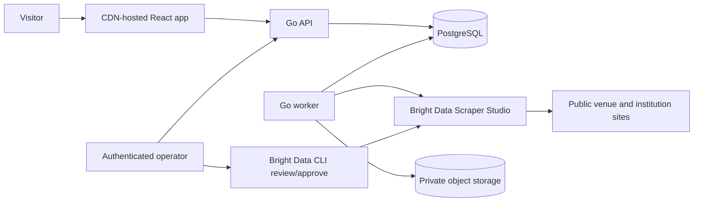

# Baahar architecture

## 1. Decision summary

Baahar begins as a **modular monolith with two deployable processes**:

- a stateless Go HTTP API for public reads and protected operator actions;
- a Go worker for schedules, Bright Data collections, ingestion, health checks,
  and outbox delivery.

Both processes use the same domain modules and PostgreSQL database. The browser
is a React/Vite application served from a CDN. Raw Bright Data outputs are stored
in private S3-compatible object storage.

This is intentionally not a microservice system. The launch workload does not
justify service discovery, Kafka, Kubernetes, distributed transactions, Redis,
Temporal, GraphQL, Elasticsearch, or a vector database. The proposed boundaries
allow an independently constrained module to be extracted later without paying
those costs now.

## 2. Technology choices

| Concern        | Choice                                                                | Reason                                                                                   |
| -------------- | --------------------------------------------------------------------- | ---------------------------------------------------------------------------------------- |
| Web            | React + Vite + strict TypeScript                                      | Direct dynamic-feed model, mature accessibility/testing, no Next.js operational coupling |
| Routing        | React Router                                                          | URL-owned city/window/filters and route-level code splitting                             |
| Server state   | TanStack Query                                                        | Cache, cancellation, retries, stale times; no bespoke global fetch store                 |
| Motion         | CSS/View Transitions first; Motion for React selectively              | High-quality shared/layout motion without hydrating every decoration                     |
| UI primitives  | Base UI or reviewed unstyled primitives                               | Accessible behaviour with complete visual ownership                                      |
| Styling        | Tokenized CSS with cascade layers and CSS Modules                     | Readable JSX, deterministic theme, no utility-class sprawl                               |
| API/worker     | Go current stable toolchain                                           | Small binaries, clear concurrency, predictable operations                                |
| HTTP           | Standard `net/http` plus a small router                               | Minimal surface and standard middleware semantics                                        |
| Database       | PostgreSQL with `pgx`                                                 | Transactions, row locking, JSON support, durable job queue                               |
| Object storage | S3-compatible; MinIO locally                                          | Immutable raw inputs independent of vendor retention                                     |
| Contracts      | OpenAPI 3.1 + JSON Schema 2020-12                                     | One source of truth and generated TypeScript API types                                   |
| Collection     | Bright Data Scraper Studio API/CLI                                    | Required custom collectors, scheduling integration, unblocking and self-healing          |
| Ask Baahar     | Stateless Responses API structured output + deterministic feed query | Natural language changes filters; the model never creates or ranks event facts            |
| Local stack    | Docker Compose for PostgreSQL + MinIO                                 | Reproducible real integration tests                                                      |
| Observability  | Structured `slog`, Prometheus-format metrics, OpenTelemetry-ready IDs | Useful operations without a heavyweight platform dependency                              |

PostGIS is deferred. City/time filtering needs ordinary indexed columns, not a
spatial extension. Add PostGIS through an ADR only when the released product has
a verified nearby/map requirement.

## 3. System context



The visitor never talks to Bright Data. Public traffic cannot multiply scraping
cost, and a source outage cannot make the public feed request hang.

### Ask Baahar boundary

Ask Baahar is a query interpreter, not a second event database or an open-ended
chatbot. One short request is sent server-side to the OpenAI Responses API with
`store: false` and a strict JSON Schema containing only Baahar's current window,
category, free-entry, and verified venue filters. The Go API validates that
intent, executes the ordinary PostgreSQL feed query, and returns only verified
event DTOs. If the model is unavailable, a small deterministic keyword parser
keeps the same surface usable and marks the interpretation as unassisted.

There is no conversation memory, embedding index, vector database, tool loop, or
model-authored event copy. The browser keeps only the current form/result state;
URLs remain the shareable source of truth after a result is applied. This is the
smallest architecture that makes natural requests useful without creating a
parallel truth system.

## 4. Repository shape

The build should use this structure, adding a directory only when its first real
file is needed:

```text
baahar/
  apps/
    web/
      src/
        app/              route composition and providers
        routes/           page-level features
        features/         feed, saved, event-detail, city-switcher
        components/       reusable product components
        ui/               small accessible primitives
        api/              generated client wrapper and query keys
        styles/           tokens, themes, resets, global layers
        test/             browser-test helpers only
  cmd/
    api/
    worker/
    migrate/
  contracts/
    openapi.yaml
    event.schema.json
    collector-output.schema.json
    examples/
  internal/
    events/
      model.go
      identity.go
      diff.go
      repository.go       consumer-owned repository interface
    sources/
      manifest.go
      health.go
      repository.go
    collections/
      service.go
      jobs.go
      ports.go             Bright and raw-store boundaries
    subscriptions/        created only when P1 begins
    platform/
      postgres/
      s3/
      brightdata/
      httpserver/
      observability/
  migrations/
  sources/
    bengaluru/
    varanasi/
    canary/
  tests/
    browser/
    live/
  docs/
  compose.yaml
  Makefile
```

There is no `utils`, `helpers`, `common`, `base`, or `manager` package. Code lives
with the product capability that owns its vocabulary. An interface is introduced
only at an effect boundary or when two real implementations exist, and it is
owned by the consumer.

## 5. Domain modules

### Events

Owns normalized events, occurrences, versions, deterministic identity, material
diffs, statuses, and public feed queries.

Pure operations:

- validate normalized invariants;
- compute occurrence identity;
- compare a current and candidate version;
- decide whether a difference is public/material;
- derive an occurrence's time-window membership.

A native source identifier is used without mutable time fields only when it is
stable for one occurrence. If one parent ID contains several performances, the
collector must expose a stable performance identifier or fall back to canonical
URL + occurrence time + venue. This keeps a corrected start time on BIC attached
to the same version history while still separating real multi-show occurrences.

### Sources

Owns source manifests, allowlisted hosts, field mappings, cadence/page budgets,
health policies, absence thresholds, and collector association.

Configuration is data with a schema, but not an executable mini-language. Source
peculiarities that cannot be represented safely remain in the Scraper Studio
collector or a small named normalizer, not a generic rules engine.

### Collections

Owns due-work scheduling, Bright Data trigger/poll/download, exact snapshot
storage, schema validation, normalization orchestration, quarantine, collection
statistics, and incidents.

### Subscriptions

Not present in P0 code. When introduced, it will own saved server-side filters,
digest scheduling, notification outbox consumption, and delivery preferences.
It must not leak notification concerns into event ingestion.

## 6. Persistence model

All identifiers are UUIDv7 or another time-sortable application-generated UUID.
External IDs remain separate and are never trusted as database keys.

### Core tables

`cities`

- `id`, `slug`, `display_name`, `timezone`, `enabled`

`venues`

- `id`, `city_id`, `name`, `normalized_key`, `address`, optional coordinates
- unique `(city_id, normalized_key)` only when the source mapping is reviewed

`sources`

- `id`, `city_id`, `slug`, `display_name`, `canonical_host`, `manifest_version`
- `collector_id`, `schema_version`, `enabled`, `freshness_ttl`
- `cadence`, `page_limit`, `absence_threshold`, `publication_state`

`collection_runs`

- `id`, `source_id`, `external_collection_id`, `triggered_at`, `completed_at`
- `status`, `raw_object_key`, `raw_sha256`, counts, health summary, error code
- unique `(source_id, external_collection_id)`

`quarantined_records`

- `id`, `collection_run_id`, `record_index`, `error_code`, bounded diagnostics
- the raw record stays in the private immutable collection artifact

`events`

- stable source-independent container: `id`, `city_id`, `canonical_title`

`event_occurrences`

- `id`, `event_id`, `source_id`, `source_identity`, local start/end dates,
  optional exact `starts_at`/`ends_at`, `time_precision`, `timezone`,
  `current_version_id`, lifecycle timestamps
- unique `(source_id, source_identity)`

`event_versions`

- append-only normalized record, `id`, `occurrence_id`, `collection_run_id`
- typed query columns plus canonical JSON and `fingerprint`
- unique `(occurrence_id, fingerprint)`

`event_changes`

- `id`, `occurrence_id`, `from_version_id`, `to_version_id`, `kind`
- material changed fields and `created_at`

`source_observations`

- presence/missing observations by complete successful run, used to avoid false
  cancellation/removal.

`jobs`

- `id`, `kind`, `payload`, `available_at`, `attempt`, `max_attempts`, lease data
- PostgreSQL workers claim bounded batches using `FOR UPDATE SKIP LOCKED`.

`outbox`

- transactional domain events for later notifications/cache invalidation.

`operator_incidents`

- source/run, health code, state, timestamps, resolution and replay link.

### Immutability rules

- Raw collection objects are content-addressed and never overwritten.
- Event versions are append-only.
- A run's outcome is terminal; a retry creates a new run linked to the prior one.
- Current-version pointers move only inside the publication transaction.
- Operator actions are auditable and never rewrite evidence.

## 7. Collection flow

```mermaid
sequenceDiagram
    participant Q as Scheduler
    participant W as Worker
    participant B as Bright Data
    participant O as Object store
    participant D as PostgreSQL

    Q->>D: enqueue due source (deduplicated lease)
    W->>B: trigger manifest Collector ID
    B-->>W: collection ID
    W->>B: poll with bounded backoff
    B-->>W: completed structured output
    W->>O: store exact bytes + SHA-256
    W->>W: parse, schema validate, normalize, health gate
    alt run healthy
        W->>D: transaction: versions + changes + observations + outbox
        W->>D: mark run published
    else run unhealthy
        W->>D: quarantine/incident; keep last verified versions
    end
```

The worker prefers a webhook notification for long collections when supported,
but treats it only as a wake-up signal. It downloads the result with its own
Bright Data credentials and verifies the expected collection/source association.
This avoids trusting an unsigned arbitrary payload.

The Baahar worker is the sole production scheduler and collection-trigger owner.
Scraper Studio's per-collector schedules stay disabled; enabling both would
create duplicate, unassociated runs and spend. Manual previews and explicitly
reviewed proof batches remain operator actions.

### Idempotency

- Schedule uniqueness: `(source_id, scheduled_window)`.
- Trigger reconciliation records the external collection ID before polling.
- Ingestion uniqueness: `(source_id, external_collection_id)`.
- Version uniqueness: `(occurrence_id, canonical_fingerprint)`.
- Outbox consumers record `(consumer, outbox_id)`.

Retries can therefore repeat at every boundary without duplicating feed entries
or sending the same future notification twice.

## 8. Collector contract and manifests

All collectors output the PRD's canonical occurrence schema. Source-specific
selectors and navigation stay inside the collector; source-specific trust and
publication rules stay in a reviewed manifest.

Example manifest shape:

```yaml
schema_version: source-manifest/v1
source: bic
city: bengaluru
canonical_hosts:
  - bangaloreinternationalcentre.org
collector_id: c_REDACTED_IN_PUBLIC_EXAMPLES
output_schema: event-occurrence/v1
schedule: "0 */6 * * *"
freshness_ttl: 12h
limits:
  pages_per_run: 80
  records_per_run: 500
health:
  minimum_records: 1
  maximum_parse_error_ratio: 0.02
  maximum_duplicate_ratio: 0.01
  missing_observations_before_removal: 2
category_map:
  Performing Arts: theatre
  Books: books
```

The actual Collector ID is committed only after the reviewed source reaches its
external collector proof gate. Secrets and access tokens are never part of a
manifest.

## 9. Health policy

A run must pass every hard gate before publication:

1. expected Collector ID and public-host inputs;
2. successful Bright Data terminal status;
3. valid JSON and supported schema version;
4. source URL host allowlist;
5. required field and invariant validation;
6. bounded parse and quarantine ratios;
7. record-count range relative to recent complete baselines;
8. duplicate ratio;
9. reasonable time distribution for the source;
10. canary facts for stable known inputs when the source supports them.

Baselines use a small rolling median, not a complicated anomaly model. The
incident reports the failed facts and sample indices; it does not dump raw pages
or credentials into logs.

Bright Data batch delivery may add a per-record `input` transport object. The
worker stores and hashes the response bytes before interpreting them. A
source-policy adapter may then remove only that member, and only when its JSON
value exactly equals the reviewed collection input for the run. The resulting
view must satisfy the unchanged collector schema; missing canonical fields,
another extra field, or any transport mismatch freezes publication. Replays
start from the immutable raw object and repeat the same check.

### Self-heal state machine

```text
healthy -> suspected_break -> publication_frozen -> repair_generated
        -> preview_verified -> approved -> replaying -> healthy
                                    \-> rejected -> publication_frozen
```

Only Bright Data changes the collector implementation. Baahar validates whether
the repaired output still honours its contract. Human approval remains required.

## 10. Public HTTP API

OpenAPI is authoritative. Handwritten frontend DTOs are prohibited.

### Read endpoints

- `GET /v1/cities`
- `GET /v1/events?city=&window=&category=&free=&venue=&cursor=&limit=`
- `POST /v1/ask`
- `GET /v1/events/{occurrence_id}`
- `GET /v1/events/{occurrence_id}/changes`
- `GET /v1/events/{occurrence_id}.ics`
- `GET /v1/sources/{source_slug}/summary`

Read responses carry `ETag`, `Cache-Control`, and stable cursors. Errors use
RFC 9457 problem details with stable machine codes and safe user messages.

### Operator endpoints

- `GET /v1/operator/sources`
- `GET /v1/operator/sources/{source_id}/runs`
- `POST /v1/operator/sources/{source_id}/runs`
- `POST /v1/operator/runs/{run_id}/replay`
- `POST /v1/operator/incidents/{incident_id}/acknowledge`

Operator endpoints are authenticated, rate limited, excluded from public API
documentation, and produce audit records. Healing approval stays in the official
Bright Data CLI/dashboard instead of reimplementing it.

### Query limits

- `limit` defaults to 24 and is capped at 60.
- Cursor payloads are signed/opaque and bind the normalized filters, first-page
  `as_of` anchor, and stable `(effective_start, occurrence_id)` boundary.
- Time ranges are named server-owned windows; omitted `window` selects the
  bounded 90-local-calendar-day Upcoming view. Clients cannot request unbounded
  history.
- Every feed query excludes occurrences whose effective end is at or before the
  anchored `as_of`. Window calculation uses the selected city's configured IANA
  timezone; no city-specific branch exists in the read path.
- Responses expose `page_size`, `has_more`, and `next_cursor` for explicit
  keyset-based Load more behaviour. Page numbers and offsets are not supported.

## 11. Concurrency and failure handling

- Every network call receives a deadline and a small retry policy based on
  idempotency and error class.
- Retries use exponential backoff with jitter and a hard elapsed-time cap.
- Workers lease jobs; expired leases are reclaimable.
- A source has at most one publication run at a time, while different sources run
  concurrently within the global Bright Data/page budget.
- Context cancellation propagates through API handlers, repositories, and
  adapters.
- Errors add operation and stable code while preserving the causal chain.
- Panics are recovered only at process/HTTP/job boundaries, logged, and surfaced
  as failed work; domain code does not use panic for control flow.

## 12. Cache and scale path

The hot public query is indexed by `(city_id, status, starts_at, id)` with partial
indexes for current discoverable occurrences. Public GETs use CDN caching and
conditional requests. An event publication emits an outbox item that invalidates
the affected city/window cache keys.

Scale in this order, only after measurement:

1. add stateless API replicas;
2. add worker concurrency within source and vendor budgets;
3. add a PostgreSQL read replica for the public feed;
4. partition old `event_versions`/observations by month if their measured size
   affects maintenance;
5. introduce an external cache only if CDN and database evidence show a need;
6. extract collection workers only when deployments or ownership require it.

The data model can hold every Indian city, but the application exposes only
reviewed, healthy city/source configurations. `All India` is an operational
expansion programme, not a hardcoded switch.

## 13. Frontend state and rendering

- City, window, and filters live in the URL.
- Remote data lives in TanStack Query.
- Device-only saved IDs and theme preference use a versioned small local store.
- Transient component state remains local.
- No Redux/Zustand/global event bus in P0.
- Routes and heavy interactions are lazy loaded.
- First viewport card count and aspect ratios are known before images load to
  prevent layout shifts.
- CSS renders the background and placeholder art; there is no JS animation loop.

True masonry/`columns` is avoided because it can scramble reading order. The
feed uses an explicit responsive grid with a small set of server-stable card
spans, preserving DOM order and preventing layout jumps.

## 14. Security model

- Source URLs can originate only from reviewed manifests and collector outputs
  whose hosts match that manifest; redirects are revalidated to prevent SSRF.
- API tokens are scoped, rotated, and loaded through the deployment secret store.
- Logs use an allowlisted attribute set; no request-body logging.
- Raw storage keys are opaque and private; public event images use an explicit
  source policy rather than exposing raw artifacts.
- Database roles separate migration, API read/write, and worker capabilities in
  production.
- CSP defaults to self; image and outbound connection hosts are enumerated.
- Dependencies and container bases are pinned and scanned.
- Public rate limits protect expensive detail/change endpoints without requiring
  identity or invasive tracking.

## 15. Observability and operations

Every run carries `trace_id`, internal run ID, source ID, and external collection
ID. Minimum metrics:

- API request duration/error/count by route template;
- feed cache hits and database query duration;
- jobs due/leased/retried/dead;
- collection duration, pages/records, accepted/quarantined counts;
- source freshness and consecutive failures;
- schema/parse/duplicate/date-health failures;
- daily page-budget consumption;
- time from source observation to published feed version.

Alerts are actionable: source stale, worker backlog, budget threshold, dead job,
or public API SLO breach. No per-event high-cardinality metric labels.

## 16. Clean-code constraints

- Packages represent product language, not technical layers alone.
- Functions do one named job and make invalid states explicit.
- Prefer small value types and constructors that enforce invariants.
- No `interface{}`/`any` in domain APIs; decode untrusted JSON at the boundary.
- No booleans whose meaning is unclear at the call site; use enums/value types.
- Money uses decimal/minor-unit-safe types, never binary floating point.
- Time accepts an injected clock in the few domain operations that need `now`.
- SQL is explicit and reviewed; no ORM hidden query behaviour.
- Comments explain a surprising invariant or external constraint, not the code's
  syntax. Dead code, placeholder abstractions, TODO dumps, and commented-out code
  fail review.
- Generated code is isolated and never manually edited.
- Refactoring is continuous but bounded to behaviour already under test.

## 17. Architecture decision triggers

Write a short ADR before any of these changes:

- adding PostGIS, Redis, a message broker, or another database;
- adding user accounts or precise location;
- letting a model author event facts, adding embeddings, or widening Ask Baahar
  beyond its validated filter-only contract;
- splitting a service from the monolith;
- enabling automatic scraper-heal approval;
- republishing source descriptions or images under a new policy;
- changing event identity or absence/removal semantics.
