# Baahar execution and quality plan

Planning date: 18 August 2026  
Submission date: 23 August 2026

## 1. Delivery rule

Build one thin, live vertical slice, then widen it. At every checkpoint the code
in the main branch must format, lint, compile, migrate, and pass the relevant
tests. There is no late `cleanup phase`; structural quality is a merge condition.

A feature is complete only when:

- its real user journey works in the production build;
- the live or source-derived data path is exercised;
- empty/error/edge states are designed;
- contracts, migration and rollback implications are resolved;
- focused tests protect the risky behaviour;
- accessibility and performance remain inside budget;
- obsolete code and dependencies introduced during the work are removed.

## 2. Workstreams and ownership

One person may own several streams during the hackathon, but responsibility must
remain explicit.

| Stream           | Accountable output                                                           | May change                                   |
| ---------------- | ---------------------------------------------------------------------------- | -------------------------------------------- |
| Product/release  | scope, go/no-go decisions, live demo, submission evidence                    | docs, release checklist                      |
| Contracts/domain | schemas, identity, time windows, versions, diffs, invariants                 | contracts, `internal/events`                 |
| Collection/data  | source manifests, Scraper Studio collectors, ingest, health, self-heal proof | sources, `internal/collections`, Bright Data |
| API/platform     | migrations, repositories, HTTP, jobs, object store, auth/operations          | Go platform modules                          |
| Experience/web   | design system, feed/detail/saved routes, responsive/a11y/performance         | `apps/web`                                   |
| Verification     | live fixtures, integration/browser/release tests, quality reports            | test suites and CI                           |

Cross-stream contract changes begin with OpenAPI/JSON Schema and one written
rationale. Frontend/backend types are generated from that contract rather than
negotiated through handwritten lookalikes.

## 3. Critical path

```mermaid
flowchart LR
    A["Bootstrap + contracts"] --> B["One BIC live collection"]
    B --> C["Normalize + publish"]
    C --> D["Real Bengaluru feed"]
    D --> E["Detail + save + ICS"]
    E --> F["Second source: Jagriti"]
    F --> G["Varanasi source"]
    G --> H["Diff + health gates"]
    H --> I["Same-ID self-heal proof"]
    I --> J["Polish, audit, release"]
```

No task that is not on, or directly unblocks, this path should consume the first
three build days.

Progress note, 18 August: BIC and Jagriti have completed their real vertical
slices. Rudraksh was attempted next but failed inside Bright Data's proxy tunnel;
its empty batch was quarantined. Varanasi remains disabled while the team ships
the proven one-city, two-source product rather than weakening the data contract.

Progress note, 19 August: the Upcoming-first feed, signed anchored cursors and
explicit Load more journey are complete. A bounded EMINDIA collector passed a
13-row dashboard preview on the same reviewed Collector ID, but its only
production crawl failed with Bright Data `proxy_config`/tunnel 403 before the
page loaded and returned exact `[]`. Bright Data ticket `#723252` confirmed an
account allowlist restriction requiring registered-business Full Access KYC.
The empty artifact was quarantined; no source migration, preview import,
personal KYC or Varanasi enablement occurred.

Progress note, later 19 August: UPISACON was evaluated and closed as optional
single-event evidence rather than a Varanasi coverage pillar. BHU Academic
Events is the sole resumed source slice. Its official public endpoint needs one
Code-worker POST, not a Browser worker or generic crawler; the local reviewed
contract currently yields ten public Varanasi records inside the 90-day horizon.
No database registration, city enablement or public row occurs before one exact
Bright production artifact passes the normal gates.

Progress note, activation 19 August: BHU passed the exact production artifact,
backend publication, and public API gates. One activation published 10/10 rows
with zero quarantine and enabled Varanasi. The two-city browser, route,
pagination, responsive, keyboard and reduced-motion acceptance then passed.

Progress note, expansion 19 August: the Dhamma Cakka contract passed its local
one-page Code-worker gates, but its schema-aligned Studio request was stopped at
the account-level proxy/allowlist boundary before page load. It remains preview
only and unpublished. Atta Galatta subsequently passed its 42-row production,
backend, immutable replay, API, and browser gates. BIEC then passed independent
source review, its one-stage Studio and Production gates, a 9/9 immutable
application publication/replay, public API acceptance, and browser journey.
Bengaluru now has four healthy official sources; the next implementation slice
returns to Varanasi's release-floor gap.

## 4. Checkpoint plan

### Checkpoint 0 — product and source lock (18 August)

Outputs:

- PRD, architecture, experience, source catalog and this execution plan;
- working-name and collision note;
- launch eight plus release floor;
- hackathon requirements and judging matrix;
- preliminary robots/terms/access notes for the first source in each city.

Exit gate:

- every P0 feature has an acceptance journey;
- no runtime LLM, microservice, native application, maps, or accounts in P0;
- architecture has no unused infrastructure component.

### Checkpoint 1 — clean foundation and contracts (18–19 August)

Tasks:

1. Initialize the independent Baahar repository/worktree structure.
2. Add EditorConfig, language/tool versions, secret-safe examples, and narrow
   ignore rules. Generated binaries, vendor folders, local data and credentials
   are excluded from Git.
3. Add OpenAPI 3.1 and Draft 2020-12 schemas with real example records.
4. Add migrations for cities, sources, runs, events, occurrences, versions,
   observations, changes, jobs, outbox, quarantine and incidents.
5. Implement pure domain identity/diff/time-window functions and table tests.
6. Bring up real PostgreSQL and MinIO locally and apply migrations.
7. Scaffold React/Vite with tokens, themes, routing, API generation and the
   accessible card/grid primitives—no fake marketing screens.

Exit gate:

- fresh clone/bootstrap command works;
- schema examples validate;
- migration up/down/up works on an empty real database;
- Go tests, web lint/typecheck/build and secret scan pass;
- no copied PakkaSeat domain or dead package remains in the new folder.

### Checkpoint 2 — first live vertical slice (19 August)

Use BIC as the correctness anchor because it exposes stable public event JSON.

Tasks:

1. Create the custom Scraper Studio Code worker and record its real `c_*` ID.
2. Trigger it through the official API, poll with bounded backoff, and store the
   exact successful output plus SHA-256 in MinIO.
3. Validate, normalize, identity/dedupe and publish into PostgreSQL.
4. Serve city and feed endpoints with cursor/ETag/cache headers.
5. Render the live Bengaluru cards and detail route in both themes.
6. Preserve one exact live artifact privately and a sanitized structured example
   publicly for hackathon proof.

Exit gate:

- a clean environment can execute Bright trigger -> stored raw -> database ->
  API -> browser without a manual data edit;
- retrigger/reingest does not duplicate events;
- missing price stays unknown;
- public feed remains available when a deliberately bad candidate run is rejected.

### Checkpoint 3 — useful product loop (19–20 August)

Tasks:

1. Complete URL-owned date/category/free filters.
2. Add local Save and changed-status handling.
3. Add correct UTC/all-day ICS generation and tests.
4. Add event/source disclosure and official-link safety.
5. Implement Jagriti and Atta Galatta; then BIEC if all gates remain green.
6. Verify multiple theatre performances do not collapse or duplicate.

Exit gate:

- Bengaluru acceptance journey passes using current source data;
- browser Back restores filters and position;
- long/multilingual/missing-image records render cleanly at target widths;
- frontend initial JS remains under the hard budget.

### Checkpoint 4 — second city and real edge cases (20–21 August)

Attempted tasks, in order:

1. Rudraksh static table: local contract passed; production request failed in
   Bright Data's proxy tunnel and emitted no publishable rows.
2. EMINDIA one-page Code worker: exact 13-row preview passed; the sole production
   crawl failed before page load with `proxy_config`/tunnel 403, returned exact
   `[]`, and was quarantined.
3. Close UPISACON as optional evidence; do not use a one-conference source as a
   city coverage pillar.
4. BHU Academic Events passed one official public JSON request, native-ID,
   strict public/Varanasi/90-day, immutable artifact, publication, API, and
   browser gates with no detail fan-out.
5. Qualify only one next source at a time. Dhamma Cakka is account-blocked;
   Atta Galatta and BIEC are fully accepted. Kashi Sansad Events is the next
   Varanasi qualification target, subject to origin, robots, and hub/detail
   consistency gates.

Exit gate:

- BHU passes its complete vertical slice or the one-city downgrade remains in
  force; three healthy Varanasi sources are still the public-release floor;
- a recurring ritual is not presented as a newly announced one-off;
- an ambiguous missing-year or retrospective article is quarantined;
- no Varanasi data is hardcoded into the web app.

### Checkpoint 5 — changes, health and self-heal (21 August)

Tasks:

1. Finish material diffs, consecutive-absence policy and source health baselines.
2. Build the protected operator source/run/incident view.
3. Add a public controlled v1/v2 canary page whose DOM changes while facts remain.
4. Run the collector against v1, demonstrate the v2 health failure and frozen
   publication, generate a Bright Data repair, inspect preview/diff, approve it,
   rerun canaries, and prove the same Collector ID produces the same contract.
5. Record exact commands, IDs, timestamps and screenshots for the demo/README.

Exit gate:

- an unhealthy run cannot move a public current-version pointer;
- change detection identifies time/status/registration changes but ignores
  cosmetic whitespace/order;
- self-heal is real, reviewed, repeatable and uses the same Collector ID;
- no production `--auto-approve` path exists.

### Checkpoint 6 — product polish and hardening (21–22 August)

Tasks:

1. Complete empty/loading/error/offline and saved-event-change states.
2. Visually inspect every route/state at the documented viewports/themes.
3. Run keyboard, screen-reader smoke, reduced-motion, 200% zoom and contrast audits.
4. Profile bundle, images, LCP/INP/CLS, database queries and worker memory.
5. Add security headers, operator authentication, rate/body limits, credential
   redaction and source redirect validation.
6. Run concurrency, retry, graceful shutdown and daily page-budget tests.
7. Remove unused dependencies, routes, exported symbols, assets, comments,
   fixtures and generated binaries.

Exit gate:

- all release gates in section 7 pass;
- production Lighthouse/Core Web Vitals lab run meets budgets or has a recorded,
  resolved root cause—not a disabled check;
- no horizontal scrollbar, clipped sheet, unstable skeleton or focus loss at any
  target viewport;
- live API/worker logs contain no token or raw content leak.

### Checkpoint 7 — freeze and submission (22–23 August)

No new product features after freeze.

Tasks:

1. Deploy a release candidate and run one live source per city end to end.
2. Run migrations from a clean production-like database and rollback rehearsal.
3. Finish README, architecture diagram, source policy, local setup, example output,
   Collector ID evidence and AI-assistant disclosure.
4. Record a short demo: user value first, then live pipeline, then controlled heal.
5. Prepare presentation and LinkedIn post without making unsupported coverage or
   sponsor-location claims.
6. Tag the exact commit used in the video/deployment and retain raw evidence.

Exit gate:

- a new evaluator can understand and run the product from the README;
- live URL and repository are public and point to the tagged release;
- all six judging criteria receive explicit evidence in the submission;
- no known P0 correctness/security issue is hidden behind demo data.

## 5. Test portfolio

Tests are selected by risk. There is no coverage-percentage target and no tests
for getters, static markup, generated clients, or framework behaviour.

### Pure/table-driven Go tests

- occurrence identity precedence and normalization;
- multiple performances and multi-day overlap;
- today/tomorrow/weekend boundaries in `Asia/Kolkata`;
- canonical fingerprint stability;
- material versus cosmetic diff fields;
- explicit free/paid/unknown and registration states;
- direct cancellation versus consecutive absence;
- recurring schedule versus one-off;
- retry/backoff classification with a fake clock only where time control matters;
- ICS escaping, UTC and all-day output.

### Contract tests

- every committed source fixture validates the collector-output schema;
- unknown fields and unsupported schema versions fail deliberately;
- generated TypeScript types/client are reproducible and clean;
- OpenAPI examples round-trip through server presenter and client decoder.

### Real infrastructure integration tests

Use PostgreSQL and MinIO, not in-memory repositories or mocked SQL:

- migration up/down/up;
- exact-byte object hash round-trip;
- run/idempotency uniqueness;
- publication transaction and outbox atomicity;
- concurrent job leasing and expired-lease reclaim;
- version pointer does not move on failed health gate;
- cursor stability during concurrent later inserts;
- operator/public authorization boundary.

External Bright Data tests are live-gated and explicitly skipped without the
required secret. A skipped call is never reported as passed/live.

### Browser journeys

Use the production frontend build and real API/database fixtures derived from
actual public source output:

1. Bengaluru choose/filter/detail/save/ICS.
2. Varanasi recurring versus dated event and official source.
3. Saved changed/cancelled event.
4. keyboard + reduced motion + both themes + responsive widths.
5. protected operator incident/replay presentation.

Mocks may intercept third-party image bytes or prevent an external navigation in
browser automation; they may not fabricate the event decisions being tested.

### Live release tests

- trigger and ingest one actual Code-worker collector per city;
- verify exact stored raw SHA-256 and normalized record sample;
- follow one public official link per source;
- validate Collector ID evidence;
- run the canary break/heal flow once before the recorded demo.

### Load and scale test

- Run the origin feed endpoint at 100 requests/second with 100 concurrent clients
  for ten minutes against a production-sized generated corpus; target p95 <=
  300ms and error rate < 0.1% before CDN caching.
- Repeat the dominant cached query through the deployed edge and record cache hit
  ratio and origin reduction rather than claiming an unmeasured national scale.
- Use generated records only for volume. Correctness assertions and the recorded
  product demo continue to use real, source-derived data.
- Exercise concurrent source jobs at the configured global page budget and prove
  the scheduler defers excess work instead of overrunning the Bright Data spend.

## 6. Code review checklist

Every change answers yes:

- Is it required by the current checkpoint?
- Does the name use the domain's vocabulary?
- Is untrusted data decoded and bounded at a boundary?
- Are errors preserved, classified and safe to show/log?
- Is time, money, identity, optionality and Unicode handled explicitly?
- Is the operation idempotent or clearly documented as not retryable?
- Is there one authoritative contract instead of duplicate types?
- Is the interface owned by its consumer and justified by an effect boundary?
- Does the SQL use the intended index and bounded result set?
- Does the UI work without hover, animation, image, and pointer precision?
- Did the change add only useful tests and remove obsolete code?
- Are secrets, PII, raw artifacts and copyrighted content protected?

## 7. Automated release gates

Exact commands are finalized during bootstrap, but CI must enforce these classes:

### Go

- `gofmt` clean;
- `go vet`;
- `staticcheck`, `errcheck`, `ineffassign` through a pinned linter config;
- `go test ./...` and `go test -race ./...` on supported packages;
- `govulncheck`;
- production binary build with reproducible version metadata.

### Web

- frozen package-manager install;
- Prettier check;
- ESLint with type-aware rules;
- TypeScript no-emit check;
- focused unit/component tests;
- production build and bundle-size check.

### System

- schema/example validation;
- migration test on real PostgreSQL;
- integration tests on PostgreSQL/MinIO;
- browser golden journeys;
- secret scan, dependency audit and container scan;
- `git diff --check` and no tracked generated binary/local artifact;
- production Lighthouse/a11y/performance budget.

## 8. Daily operating rhythm

- Start: run status/gates, select the smallest checkpoint blocker, confirm live
  source assumptions.
- During: merge small vertical changes; keep the app runnable; record an ADR only
  for a real architectural fork.
- Midday: one live-data check and one responsive browser sweep.
- End: full relevant gates, remove debris, update checkpoint evidence and risks.
- Never end a day with a knowingly broken main branch or unlabelled hardcoded data.

## 9. Scope-control decisions

These choices are already made unless new evidence changes them:

- React/Vite, not Next.js.
- Go modular monolith, not services.
- PostgreSQL, no Redis/search engine/PostGIS in P0.
- scheduled global collections, no visitor-triggered scrape.
- deterministic data operations, no product-runtime LLM.
- device-local saves, no accounts.
- web release, no Windows/macOS native application.
- source-backed visual feed, no scraper internals in public navigation.
- manual review before self-heal approval.

## 10. Release downgrade ladder

If time becomes constrained, remove in this order without damaging the core:

1. fourth source in each city;
2. share action;
3. decorative motion beyond the card/detail transition;
4. extra categories beyond the reliable source mappings;
5. Varanasi fourth source;
6. public change-history detail, while retaining internal diff/status correctness.

Never cut schema/health validation, provenance, idempotency, official links,
accessibility, security, or the same-ID self-heal proof. Those are the product.
